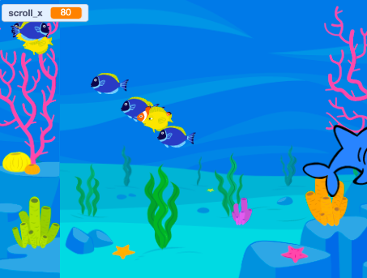

## You will make

Create a game that uses clones to make swarms of insects, schools of fish, flocks of birds, or any group of animals that you want.

**Groups of animals** such as swarms, schools, and flocks will often move together in what might appear to be random ways, but when you look at the entire group, there will be some order in their movements.

You will:
+ Use clones to generate a group of animals
+ Use the random operator to allow clones to act individually
+ Give clones a game-like objective

--- no-print ---

### Play ▶️

--- task ---

  

Move the mouse to direct the bats. Keep them away from the lion and the pterodactyl. Try and get them to eat the butterflies, to generate more bats.

**Swarms, schools, and flocks**: [See inside](https://scratch.mit.edu/projects/546736449/editor)

<iframe src="https://scratch.mit.edu/projects/547542437/embed" allowtransparency="true" width="485" height="402" frameborder="0" scrolling="no" allowfullscreen></iframe>

--- /task ---

### Get ideas 💭

You are going to make some design decisions to create your game. Think about what type of creature you want to clone, and what the creatures will do.

--- task ---

Explore these example projects to get more ideas:

**Fish feeder**: [See inside](https://scratch.mit.edu/projects/546736569/editor){:target="_blank"}

<iframe src="https://scratch.mit.edu/projects/546736569/embed" allowtransparency="true" width="485" height="402" frameborder="0" scrolling="no" allowfullscreen></iframe>

**Bird strike**: [See inside](https://scratch.mit.edu/projects/546736368/editor){:target="_blank"}

<iframe src="https://scratch.mit.edu/projects/546736368/embed" allowtransparency="true" width="485" height="402" frameborder="0" scrolling="no" allowfullscreen></iframe>

--- /task --- --- /no-print ---

--- print-only ---

### Get ideas 💭

You are going to make some design decisions to create your game. See inside the example projects in or Scratch 3: Clones examples Scratch studio https://scratch.mit.edu/studios/29971894/){:target="_blank"}.

--- /print-only ---

