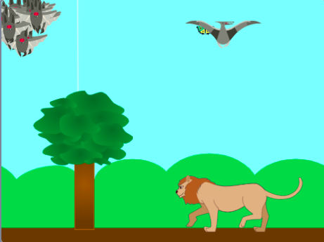
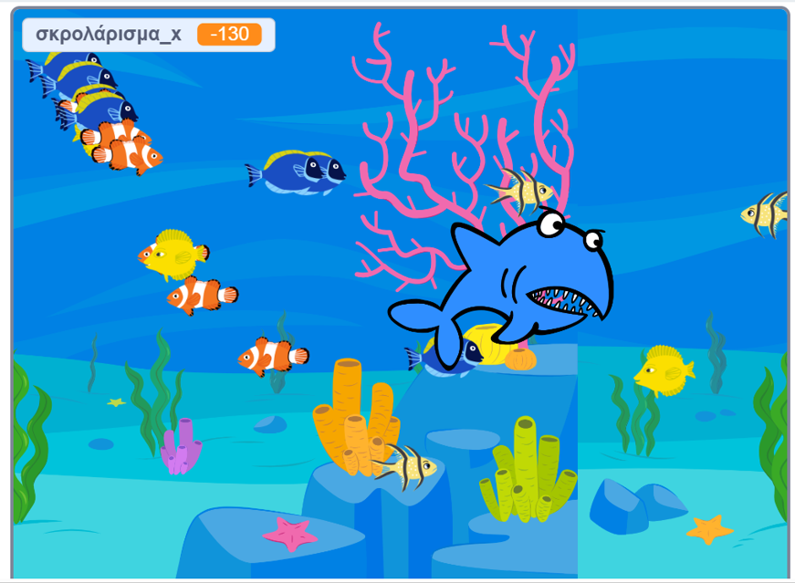

## Θα φτιάξεις

Δημιούργησε ένα παιχνίδι που χρησιμοποιεί κλώνους για να φτιάξεις σμήνη, κοπάδια, αγέλες ή οποιαδήποτε ομάδα ζώων θέλεις.

**Ομάδες ζώων** όπως σμήνη, κοπάδια και αγέλες συχνά κινούνται μαζί με τρόπους που μπορεί να φαίνονται τυχαίοι, αλλά όταν κοιτάξεις ολόκληρη την ομάδα, θα υπάρχει κάποιο σύστημα στις κινήσεις τους.

Θα:
+ Χρησιμοποιήσεις κλώνους για να δημιουργήσεις μια ομάδα ζώων
+ Χρησιμοποιήσεις τον τυχαίο τελεστή για να επιτρέψεις στους κλώνους να ενεργούν μεμονωμένα
+ Δώσεις στους κλώνους έναν στόχο που μοιάζει με παιχνίδι

--- no-print ---

### Παίξε▶️

--- task ---

  

Μετακίνησε το ποντίκι για να κατευθύνεις τις νυχτερίδες. Κράτησε τις μακριά από το λιοντάρι και τον πτεροδάκτυλο. Προσπάθησε να τις κάνεις να φάνε τις πεταλούδες, για να γεννήσουν περισσότερες νυχτερίδες.

**Σμήνη, κοπάδια και αγέλες**: [Δείτε μέσα](https://scratch.mit.edu/projects/547542437/editor)

<iframe src="https://scratch.mit.edu/projects/547542437/embed" allowtransparency="true" width="485" height="402" frameborder="0" scrolling="no" allowfullscreen></iframe>

--- /task ---

### Πάρε ιδέες💭

Θα πάρεις μερικές σχεδιαστικές αποφάσεις για να δημιουργήσεις το παιχνίδι σου. Σκέψου τι είδους πλάσμα θέλεις να κλωνοποιήσεις και τι θα κάνουν τα πλάσματα.

--- task ---

Μελέτησε τα παρακάτω παραδείγματα έργων για να πάρεις περισσότερες ιδέες:

**Ταΐστρα ψαριών**: [Δες μέσα](https://scratch.mit.edu/projects/546736569/editor){:target="_blank"}

<iframe src="https://scratch.mit.edu/projects/546736569/embed" allowtransparency="true" width="485" height="402" frameborder="0" scrolling="no" allowfullscreen></iframe>

**Χτύπημα πουλιού**: [Δες μέσα](https://scratch.mit.edu/projects/546736368/editor){:target="_blank"}

<iframe src="https://scratch.mit.edu/projects/546736368/embed" allowtransparency="true" width="485" height="402" frameborder="0" scrolling="no" allowfullscreen></iframe>

--- /task --- --- /no-print ---

--- print-only ---

### Πάρε ιδέες 💭

Θα πάρεις μερικές σχεδιαστικές αποφάσεις για να δημιουργήσεις το παιχνίδι σου. Δες μέσα στα παραδείγματα έργων στο Scratch 3: Κλώνοι παραδείγματα Scratch studio (https://scratch.mit.edu/studios/29971894/){:target="_blank"}.

--- /print-only ---

