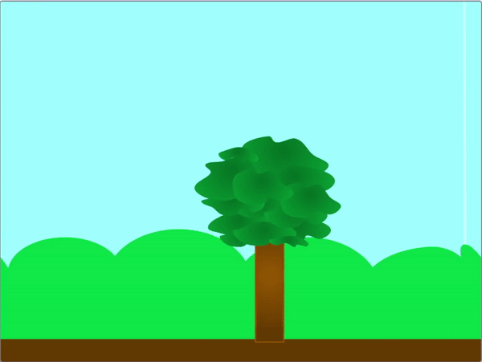
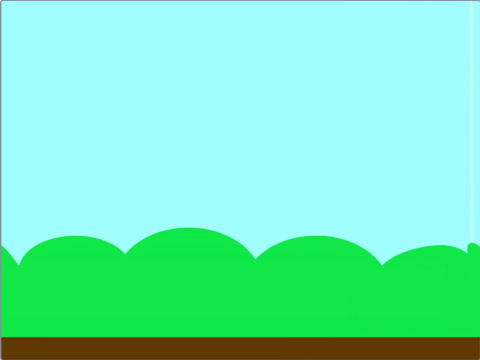
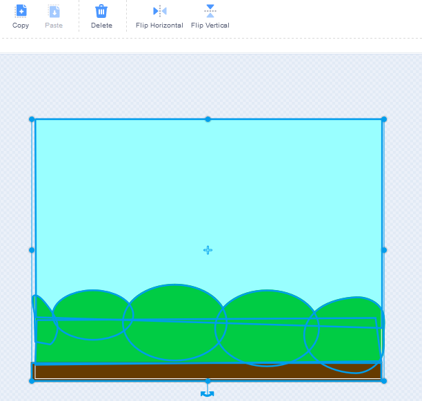
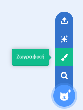
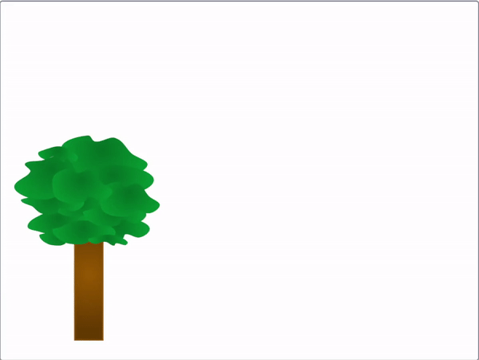

## Δημιούργησε τη σκηνή κύλισης

<div style="display: flex; flex-wrap: wrap">
<div style="flex-basis: 200px; flex-grow: 1; margin-right: 15px;">
Δημιούργησε μια νέα σκηνή και, στη συνέχεια, κάνε την να κυλά κινώντας του ποντίκι.
</div>
<div>
{:width="300px"}
</div>
</div>

 --- task ---

Άνοιξε ένα [νέο έργο Scratch](https://rpf.io/scratch-new){:target="_blank"}. Το Scratch θα ανοίξει σε νέα καρτέλα του φυλλομετρητή.

[[[working-offline]]]

--- /task ---

Σκέψου τι είδους σκηνή θα δημιουργήσεις. Μπορείς να διαλέξεις μερικά αντικείμενα τώρα, για να εμπνευστείς. Στη συνέχεια, επίλεξε ένα υπόβαθρο που πιστεύεις ότι θα ταιριάζει στη σκηνή που φαντάζεσαι.

--- task ---

Επίλεξε ένα κατάλληλο υπόβαθρο για τη σκηνή σου, ένα που να ταιριάζει με το περιβάλλον όπου θα ζούσαν τα ζώα σου.

[[[generic-scratch3-backdrop-from-library]]]

--- /task ---

Θέλεις η κίνηση του ποντικιού να επιτρέπει την κύλιση στο παιχνίδι σου. Μπορείς ή να κάνεις τα αντικείμενα του προσκήνιου να κινούνται ή να μετατρέψεις το υπόβαθρο σε αντικείμενο και να το κινείς.

--- task ---

Είτε πρόσθεσε επιπλέον αντικείμενα στη σκηνή σου, τα οποία θα κυλούν όταν κινείται το ποντίκι, είτε μετάτρεψε το υπόβαθρό σου σε αντικείμενο και όταν κινείται το ποντίκι θα κυλάς αυτό το αντικείμενο.

--- collapse ---
---
title: Μετατροπή υποβάθρου και κύλιση
---



Στον επεξεργαστή χρωμάτων **Υπόβαθρα**, επίλεξε ολόκληρο το υπόβαθρο και στη συνέχεια από το μενού χρησιμοποίησε την επιλογή **Αντιγραφή** για να αντιγράψεις ολόκληρο το υπόβαθρο.



Ζωγράφισε ένα νέο αντικείμενο και επικόλλησε τη σκηνή υπόβαθρου στο νέο αντικείμενο έτσι ώστε να γίνει μία από τις ενδυμασίες.



Για να προσθέσεις συμπεριφορά κύλισης στο νέο σας αντικείμενο, μπορείς να χρησιμοποιήσεις τα ακόλουθα scripts. Θα χρειαστείς κάποιον τρόπο για να πεις αν το αντικείμενο κινείται αριστερά ή δεξιά. Στο παράδειγμα, χρησιμοποιείται μια μετάδοση, αλλά αυτή θα μπορούσε να είναι η θέση του ποντικιού ή το πάτημα πλήκτρων/κουμπιών.

```blocks3
when I receive [αριστερά v]
change x by (3)

when I receive [δεξιά v]
change x by (-3)

when I receive [έναρξη v]
go to [υπόβαθρο v] layer
go to x: (0) y: (0)
create clone of [εαυτού μου v]
change x by (460) 
broadcast [σκρολάρισμα v]

when I receive [σκρολάρισμα v]
forever
if <(x position) > (460)> then
set x to (-460)
end
if <(x position) < (-460)> then
set x to (460)
end
```

--- /collapse ---

--- collapse ---
---
title: Κάνε τα αντικείμενα να κυλούν με την κίνηση του ποντικιού
---



Πρόσθεσε τον ακόλουθο κώδικα στο αντικείμενο του προσκήνιου για να κάνεις κύλιση αριστερά και δεξιά καθώς το ποντίκι μετακινείται προς τις 2 κατευθύνσεις της οθόνης. Μπορείς να προσαρμόσεις τους αριθμούς σύμφωνα με τις προτιμήσεις σου.

```blocks3
when flag clicked
go to x: (0) y: (-80)
forever
if <(mouse x) > (200)> then
change x by (-10)
end
if <(mouse x) < (-200)> then
change x by (10)
end
if <(x position) > (290)> then
set x to (-280)
end
if <(x position) < (-290)> then
set x to (280)
end
```

--- /collapse ---

--- /task ---

Αν θέλεις, μπορείς να συνδυάσεις και τις δύο τεχνικές.


--- save ---
