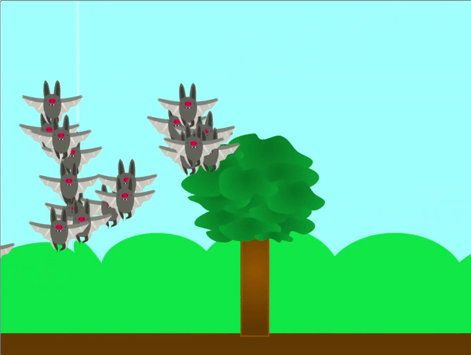
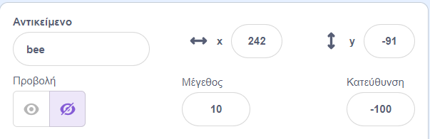

## Πρόσθεσε τους κλώνους σου

<div style="display: flex; flex-wrap: wrap">
<div style="flex-basis: 200px; flex-grow: 1; margin-right: 15px;">
Σε αυτό το βήμα, θα δημιουργήσεις μερικούς κλώνους που θα είναι σμήνη, κοπάδια και αγέλες.
</div>
<div>
{:width="300px"}
</div>
</div>

<p style="border-left: solid; border-width:10px; border-color: #0faeb0; background-color: aliceblue; padding: 10px;">
Τα **κοινωνικά ζώα** τείνουν να ζουν σε ομάδες. Μερικά παραδείγματα μπορούν να βρεθούν σε είδη μελισσών, μυρμηγκιών, πτηνών, ψαριών και θηλαστικών όπως αγελάδες και πρόβατα.
</p>

--- task ---

**Επίλεξε:** Επίλεξε ένα αντικείμενο με το όνομα **ζώο**. Είναι καλύτερο να επιλέξεις ένα αντικείμενο που αντιπροσωπεύει ένα κοινωνικό ζώο, αλλά η επιλογή είναι δική σου. Αν προτιμάς, μπορείς να σχεδιάσεις το δικό σου αντικείμενο ή να ανεβάσεις ένα στο Scratch από μια εικόνα που έχεις βρει στο διαδίκτυο.

[[[generic-scratch3-add-sprite-from-file]]]

[[[generic-scratch3-sprite-from-library]]]

[[[scratch3-backdrops-and-sprites-using-shapes]]]

--- /task ---

Αυτό το αντικείμενο θα έχει **πολλούς** κλώνους, οπότε μπορεί να είναι πολύ μεγάλο για να ξεκινήσει η σκηνή.

--- task ---

Άλλαξε την ιδιότητα μεγέθους του αντικείμένου με μια τιμή που θεωρείς λογική.



--- /task ---

--- task ---

Όταν κάνεις κλικ στη σημαία, το αντικείμενο του ζώου σου θα πρέπει να δημιουργήσει μερικούς κλώνους και μετά να κρυφτεί. **Επίλεξε**: Μπορείς να επιλέξεις πόσους κλώνους θα δημιουργούνται.

```blocks3
when flag clicked
show
repeat (20)
create clone of [εαυτού μου v]
end
hide
```

--- /task ---

Τα κλωνοποιημένα ζώα σου πρέπει τώρα να συγκεντρώσουν λίγη τροφή. Για να τα βοηθήσεις, μπορείς να χρησιμοποιήσεις τον δείκτη του ποντικιού σου για να τα καθοδηγήσεις.

--- task ---

Πρόσθεσε μπλοκ έτσι ώστε οι κλώνοι να κινούνται προς τον δείκτη του ποντικιού με τυχαίο τρόπο.

--- collapse ---
---
title: Ολισθαίνοντας για τυχαίο χρόνο
---

Ο παρακάτω κώδικας θα κάνει τους κλώνους να ολισθαίνουν προς τον δείκτη του ποντικιού σε τυχαίο χρόνο.

```blocks3
when I start as a clone
forever
glide (pick random (1) to (3)) secs to (δείκτη ποντικιού v)
```

--- /collapse ---

--- collapse ---
---
title: Ολίσθηση προς τον δείκτη του ποντικιού με τυχαία θέση
---

Ο παρακάτω κώδικας θα κάνει τους κλώνους να ολισθαίνουν προς τον δείκτη του ποντικιού, αλλά θα προσθέσει κάποια τυχαιότητα στην θέση.

```blocks3
when I start as a clone
forever
glide (pick random (1) to (2)) secs to x: ((pick random (-40) to (40)) + (mouse x)) y: ((pick random (-40) to (40)) + (mouse y))
```

--- /collapse ---

--- /task ---

--- task ---

**Δοκιμή**: Δοκίμασε να εκτελέσεις τον κώδικά σου. Συμπεριφέρονται οι κλώνοι σου όπως περίμενες; Χρειάζεται να αλλάξεις τον αριθμό των κλώνων που δημιουργούνται ή τον τρόπο με τον οποίο κινούνται;

--- /task ---

--- save ---
