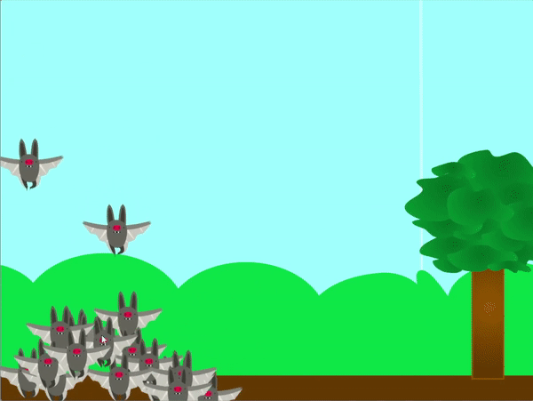

## Τάισε τους κλώνους σου

<div style="display: flex; flex-wrap: wrap">
<div style="flex-basis: 200px; flex-grow: 1; margin-right: 15px;">
Τώρα είναι η ώρα να ταΐσεις τα κλωνοποιημένα ζώα σου. Ο παίκτης πρέπει να τα καθοδηγήσει σε μια πηγή τροφής, ώστε να μπορέσουν να τη συλλέξουν.
</div>
<div>
{:width="300px"}
</div>
</div>

--- task ---

Διάλεξε, ανέβασε ή ζωγράφισε ένα αντικείμενο που να αναπαριστά την τροφή που θα φάνε τα ζώα σου.

--- /task ---

--- task ---

Κάνε την τροφή να εμφανίζεται στην οθόνη. Θα μπορούσε να εμφανιστεί σε τυχαία θέση και σε τυχαίες χρονικές στιγμές. Μπορεί να κινείται τυχαία στην οθόνη. Ίσως η τροφή των ζώων σας να μην κινείται, αλλά θα πρέπει να κυλάει με το υπόλοιπο τοπίο.

--- collapse ---
---
title: Κάνε ένα αντικείμενο να εμφανίζεται σε τυχαία θέση για τυχαίο χρόνο
---

Προσάρμοσε το εύρος `τυχαίου`{:class='block3operators'} για να αλλάξεις τη συχνότητα εξαφάνισης και επανεμφάνισης του αντικειμένου.

```blocks3
when flag clicked
forever
hide
wait (pick random (1) to (10)) seconds
show
go to (rτυχαία θέση v)
wait (pick random (1) to (10)) seconds
```

--- /collapse ---

--- collapse ---
---
title: Μετακίνηση ενός αντικειμένου τυχαία στην οθόνη
---

Προσάρμοσε το εύρος `τυχαίου`{:class='block3operators'} για να αλλάξεις πόσο γρήγορα κινείται το αντικείμενο στην οθόνη.

```blocks3
when flag clicked
forever
glide (pick random (1) to (2)) secs to (rτυχαία θέση v)
```

--- /collapse ---

--- collapse ---
---
title: Κάνε τα αντικείμενα να κυλούν με την κίνηση του ποντικιού
---

Πρόσθεσε τον ακόλουθο κώδικα στο αντικείμενό σου για να κάνεις κύλιση αριστερά και δεξιά καθώς το ποντίκι μετακινείται προς τις 2 κατευθύνσεις της οθόνης.

```blocks3
when flag clicked
go to x: (0) y: (-80)
forever
if <(mouse x) > (200)> then
change x by (-10)
end
if <(mouse x) < (-200)> then
change x by (10)
end
if <(x position) > (290)> then
set x to (-280)
end
if <(x position) < (-290)> then
set x to (280)
end
```

**Δοκιμή**: Πρέπει να δοκιμάσεις τον κώδικά σου για να βεβαιωθείς ότι η ταχύτητα κύλισης δεν είναι πολύ γρήγορη ή πολύ αργή. Επίσης, βεβαιώσου ότι το αντικείμενο φεύγει και επαναεισέρχεται σωστά στην οθόνη, καθώς οι τιμές θα διαφέρουν ανάλογα με το μέγεθος του αντικειμένου σου.

--- /collapse ---

--- /task ---

Τώρα που τα ζώα σου έχουν κάτι να φάνε, μπορείς να τα καθοδηγήσεις με τον δείκτη του ποντικιού σου προς την τροφή τους. Το ερώτημα είναι, τι θα πρέπει να συμβεί όταν φτάσουν στην τροφή;

--- task ---

Πρόσθεσε κώδικα ώστε τα ζώα σου να μπορούν να φάνε την τροφή τους. Όταν τρώνε τροφή θα πρέπει να εξαφανίζεται: εδώ είναι μερικές ιδέες για το τι θα συμβεί στη συνέχεια και πώς θα μπορούσε να βοηθήσει τα ζώα σου.

1. Δημιούργησε περισσότερους κλώνους
1. Αύξησε το μέγεθος των κλώνων σου
1. Αύξηση σκορ

--- collapse ---
---
title: Φάε το φαγητό
---

Μια μικρή προσθήκη στον κώδικά σου θα κάνει την τροφή να εξαφανιστεί όταν το αγγίξει ένας κλώνος.

Στο αντικείμενο του **ζώου**, πρόσθεσε μπλοκ έτσι ώστε όταν ένας κλώνος αγγίξει το αντικείμενο **τροφής**, να μεταδίδει ένα μήνυμα.

```blocks3
when I start as a clone
forever
if <touching [ζώο v]> then
broadcast (φαγώθηκε v)
end
```

Στη συνέχεια, στο αντικείμενο **φαγητό**, εξαφάνισέ το όταν λαμβάνει την μετάδοση.

```blocks3
when I receive [φαγώθηκε v]
hide
```

--- /collapse ---

--- collapse ---
---
title: Μεγάλωσε έναν κλώνο, φτιάξε ένα νέο κλώνο, ή αύξησε το σκορ
---

Αυτός ο κώδικας θα επιτρέπει στους κλώνους να μεγαλώνουν σε μέγεθος κάθε φορά που τρώνε κάποια τροφή.

```blocks3
when I start as a clone
forever
if <touching [ζώο v]> then
broadcast (φαγώθηκε v)
change size by (20)
end
```

Αυτό θα δημιουργεί έναν νέο κλώνο κάθε φορά που τρώνε λίγη τροφή.

```blocks3
when I start as a clone
forever
if <touching [ζώο v]> then
broadcast (φαγώθηκε v)
create clone of [εαυτού μου v]
end
```

Αυτό θα αυξήσει το σκορ όταν έχει καταναλωθεί κάποια τροφή.

```blocks3
when flag clicked
set [σκορ v] to (0)

when I start as a clone
forever
if <touching [ζώο v]> then
broadcast (φαγώθηκε v)
change [σκορ v] by (10)
end
```
--- /collapse ---

--- /task ---

