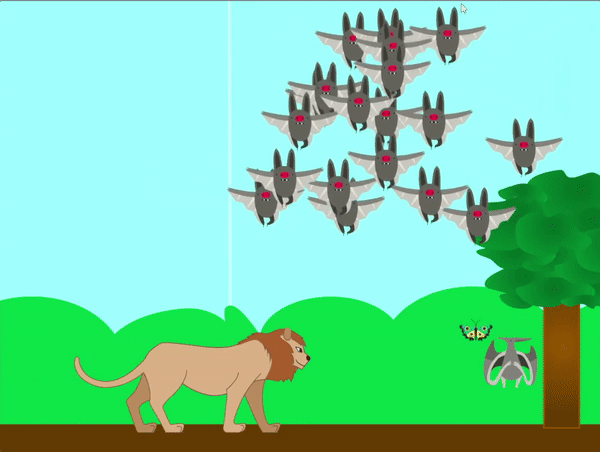

## Πρόσθεσε έναν θηρευτή

<div style="display: flex; flex-wrap: wrap">
<div style="flex-basis: 200px; flex-grow: 1; margin-right: 15px;">
Τώρα μπορείς να προσθέσεις έναν θηρευτή που θα μπορεί να φάει μερικούς από τους κλώνους.
</div>
<div>
{:width="300px"}
</div>
</div>

Πρέπει να αποφασίσεις για τον τύπο του θηρευτή που θέλεις να επιλέξεις, καθώς αυτό μπορεί να επηρεάσει τον τρόπο που θα κινηθεί.

Ένας χερσαίος θηρευτής μπορεί να κινείται τυχαία μπρος-πίσω στο έδαφος, αλλά ένα ιπτάμενος θηρευτής μπορεί να κινείται τυχαία στον αέρα.

--- task ---

Διάλεξε, ανέβασε ή ζωγράφισε το αντικείμενο σου **θηρευτής**.

--- /task ---

--- task ---

Πρόσθεσε κύλιση στο αντικείμενο **θηρευτής**, έτσι ώστε να φαίνεται ότι κινείται καθώς κινείται το υπόβαθρο. Μπορείς να αλλάξεις τις τιμές `άλλαξε x κατά`{:class='block3motion'} για να αλλάξεις την ταχύτητα του θηρευτή.

```blocks3
when flag clicked
go to x: (0) y: (-80)
forever
if <(mouse x) > (200)> then
change x by (-3)
end
if <(mouse x) < (-200)> then
change x by (3)
end
```

--- /task ---


--- task ---

Κίνησε τον θηρευτή σου έτσι ώστε να κινείται τυχαία στη Σκηνή, μαζί με την κύλιση.

--- collapse ---
---
title: Κίνηση σε ένα αντικείμενο που πετάει τυχαία
---

Τα ακόλουθα μπλοκ θα προκαλέσουν ένα αντικείμενο να πετάξει τυχαία γύρω από το Σκηνικό. Μπορείς να προσαρμόσεις τις τιμές για να αλλάξεις την ταχύτητα του αντικειμένου.

```blocks3
when flag clicked
set rotation style [left-right v]
forever
point in direction (pick random (0) to (360))
repeat (10)
wait (0.1) seconds
next costume
move (20) steps
if on edge, bounce
```

--- /collapse ---

--- collapse ---
---
title: Κίνηση σε ένα αντικείμενο που περπατά τυχαία
---

Τα ακόλουθα μπλοκ θα κάνουν ένα αντικείμενο να κινείται τυχαία κατά μήκος του άξονα x (οριζόντια). Θα χρειαστείς μια μεταβλητή για να αποθηκεύσεις αν το αντικείμενο κινείται αριστερά ή δεξιά.

```blocks3
when flag clicked
set rotation style [left-right v]
forever
set [left-right v] to (pick random (-1) to (1))
if <(left-right) > (0)> then
point in direction (90)
else
point in direction (-90)
repeat (10)
wait (0.1) seconds
next costume
move (20) steps
if on edge, bounce
```

--- /collapse ---

--- /task ---

--- task ---

Για να ολοκληρώσεις, μπορείς να εξαφανίσεις τους κλώνους όταν έρθουν σε επαφή με τον θηρευτή. Εάν επέλεξες να προσθέσεις μια μεταβλητή σκορ, τότε ίσως το σκορ να μειώνεται κάθε φορά. Αν επέλεξες να κάνεις τους κλώνους να αυξάνουν σε μέγεθος όταν τρώνε κάποια τροφή, τότε ίσως μπορούν να μειωθούν σε μέγεθος.

```blocks3
when I start as a clone
forever
if <touching [predator v]> then
change [score v] by [-10] //Choose this to reduce the score
change size by [-10] //Choose this to reduce the size
delete this clone //Choose this to remove the clone
```

--- /task ---

