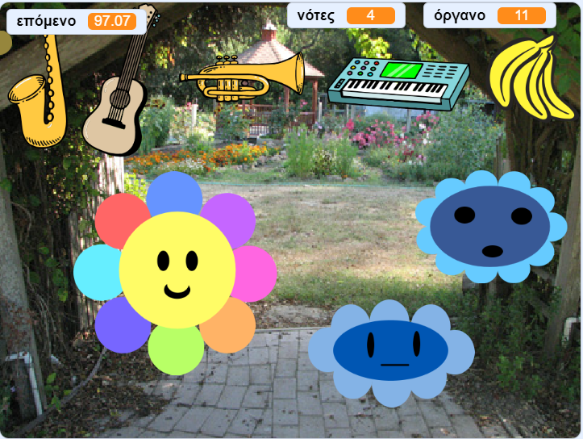

## Τι υπάρχει στη συνέχεια;

Αν ακολουθείς το μονοπάτι [Περαιτέρω Scratch](https://projects.raspberrypi.org/en/pathways/further-scratch), μπορείς να μεταβείς στο έργο [Δημιουργός μουσικής](https://projects.raspberrypi.org/en/projects/music-maker). Σε αυτό το έργο, θα σχεδιάσεις τον δικό σου δημιουργό ψηφιακής μουσικής.

--- print-only ---

--- /print-only ---

--- no-print ---

  <iframe allowtransparency="true" width="485" height="402" src="https://scratch.mit.edu/projects/embed/520146902/?autostart=false" frameborder="0"></iframe>

--- /no-print ---

Αν θέλεις να διασκεδάσεις περισσότερο εξερευνώντας το Scratch, τότε θα μπορούσες να δοκιμάσεις οποιοδήποτε από [αυτά τα έργα](https://projects.raspberrypi.org/en/projects?software%5B%5D=scratch&curriculum%5B%5D=%201).
