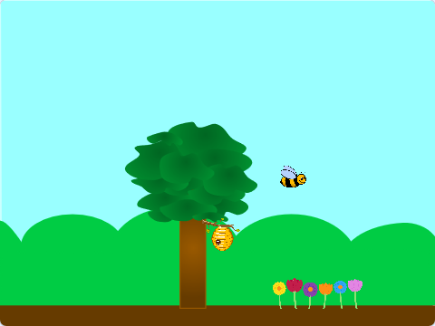
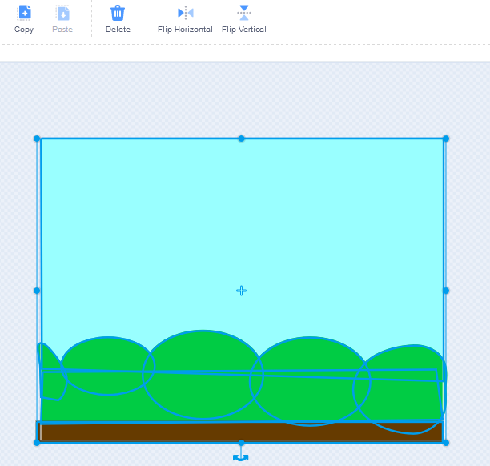
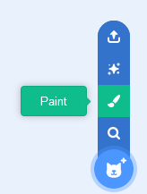
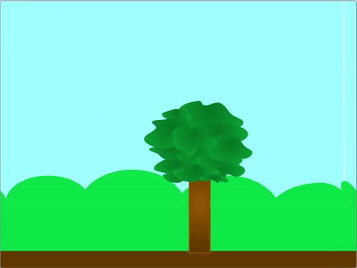

## Create the creatures

<div style="display: flex; flex-wrap: wrap">
<div style="flex-basis: 200px; flex-grow: 1; margin-right: 15px;">
Create a new sprite and then clone it to fill the stage with your creatures.
</div>
<div>
{:width="300px"}
</div>
</div>
 
 --- task ---

Open a [new Scratch project](https://rpf.io/scratch-new){:target="_blank"}. Scratch will open in another browser tab

[[[working-offline]]]

--- /task ---


--- task ---

<p style="border-left: solid; border-width:10px; border-color: #0faeb0; background-color: aliceblue; padding: 10px;">
**Social animals** tend to live in groups. Some examples can be found in species of bees, ants, birds, fish and mammals such as cows and sheep.
</p>

**Choose:** Choose an animal sprite. It is best to choose a sprite that represents a social animal, but the choice is up to you. If you prefer you could draw your own sprite, or upload one to Scratch from a picture you have found online.

[[[generic-scratch-add-sprite-from-file]]]

[[[generic-scratch-sprite-from-library]]]

[[[scratch3-backdrops-and-sprites-using-shapes]]]

--- /task ---

This sprite will have **lots** of clones, so it might be a little too big for the stage to begin with.

--- task ---

Change the size property of the sprite to a value you think is sensible.


--- /task ---

--- task ---

Choose a fitting backdrop for your scene, that would match the environment where your animal would live.

[[[generic-scratch3-backdrop-from-library]]]

--- /task ---

Moving the mouse will add scrolling behavior to your game. You can either make foreground sprites move, or you can turn the backdrop into a sprite and have this move.

--- task ---

Either add additional sprites to your scene, that scroll when the mouse is moved, or convert your backdrop into a sprite and have this scroll when the mouse moves.

--- collapse ---
---
title: Convert a backdrop and make it scroll with mouse motion
---


In the **Backdrops** paint editor, select the entire backdrop and then use the **Copy** menu item to copy the entire backdrop.



Paint a new sprite and the paste the backdrop scene into the new sprite so it becomes one of the costumes.



To add scrolling behavior to your new sprite you can use the following scripts. You will need to create a `scroll_x`{:class='block3variables'} variable.

```blocks3
when flag clicked
go to [back v] layer
create clone of (myself v)
go to x: (0) y: (0)
set [scroll_x v] to 0
forever
if <(mouse x) > (200)> then
change [scroll_x v] by (-5)
end
if <(mouse x) < (-200)> then
change [scroll_x v] by (5)
go to x: ((scroll_x) mod (480)) y: (0)

when I start as clone
forever
go to x: ((scroll_x) mod (-480)) y: (0)
```

--- /collapse ---

--- collapse ---
---
title: Make sprites scroll with mouse motion
---


Add the following code to your foreground sprite, to make it scroll left and right as the mouse is moved to either side of the screen. You can adjust the numbers to your liking.

```blocks3
when flag clicked
go to x: (0) y: (-80)
forever
if <(mouse x) > (200)> then
change x by (10)
end
if <(mouse x) < (-200)> then
change x by (-10)
end
if <(x position) > (290)> then
set x to (-280)
end
if <(x position) < (-290)> then
set x to (280)
end
```

--- /collapse ---

--- /task ---

If you like, you can combine the two techniques.




--- save ---