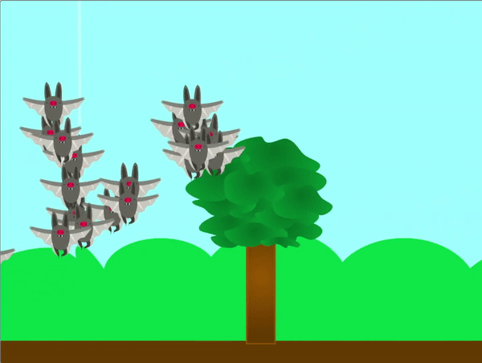
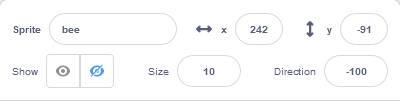

## Add your clones

<div style="display: flex; flex-wrap: wrap">
<div style="flex-basis: 200px; flex-grow: 1; margin-right: 15px;">
In this step, you will make some clones that will swarm, flock, or school together.
</div>
<div>
{:width="300px"}
</div>
</div>

<p style="border-left: solid; border-width:10px; border-color: #0faeb0; background-color: aliceblue; padding: 10px;">
**Social animals** tend to live in groups. Some examples can be found in species of bees, ants, birds, fish, and mammals such as cows and sheep.
</p>

--- task ---

**Choose:** Choose an **animal** sprite. It is best to choose a sprite that represents a social animal, but the choice is up to you. If you prefer, you could draw your own sprite, or upload one to Scratch from a picture you have found online.

[[[generic-scratch-add-sprite-from-file]]]

[[[generic-scratch-sprite-from-library]]]

[[[scratch3-backdrops-and-sprites-using-shapes]]]

--- /task ---

This sprite will have **lots** of clones, so it might be a little too big for the stage to begin with.

--- task ---

Change the size property of the sprite to a value you think is sensible.



--- /task ---

--- task ---

When the flag is clicked, your animal sprite should generate some clones, and then hide itself.
**Choose**: You can choose how many clones are generated.

```blocks3
when flag clicked
show
repeat (20)
create clone of [myself v]
end
hide
```

--- /task ---

Your cloned animals now need to gather some food. To help them out, you can use your mouse-pointer to guide them.

--- task ---

Add blocks so that the clones move towards the mouse-pointer in a random fashion.

--- collapse ---
---
title: Gliding over a random time
---

The following code will have the clones glide towards the mouse-pointer in a random time.

```blocks3
when I start as a clone
forever
glide (pick random (1) to (3)) secs to (mouse-pointer v)
```

--- /collapse ---

--- collapse ---
---
title: Gliding to the mouse-pointer with a random position
---

The following code will have the clones glide towards the mouse-pointer, but will add some randomness to the position.

```blocks3
when I start as a clone
forever
glide (pick random (1) to (2)) secs to x: ((pick random (-40) to (40)) + (mouse x)) y: ((pick random (-40) to (40) + (mouse y)))
```

--- /collapse ---

--- /task ---

--- task ---

**Test**: Have a go at running your code. Do your clones behave as you expect? Do you need to alter the number of clones that are made, or the way they move?

--- /task ---

--- save ---
