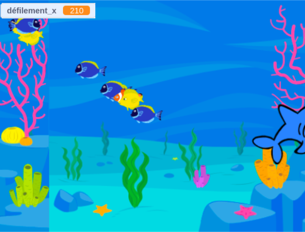

## Ce que tu vas faire

Crée un jeu qui utilise des clones pour fabriquer des essaims d'insectes, des bancs de poissons, des nuées d'oiseaux ou tout groupe d'animaux que tu veux.

**Des groupes d'animaux** tels que des essaims, des bancs et des nuées se déplacent souvent ensemble de manière apparemment aléatoire, mais lorsque tu regardes l'ensemble du groupe, il y aura un certain ordre dans leurs mouvements.

Tu vas devoir :
+ Utiliser les clones pour générer un groupe d'animaux
+ Utiliser l'opérateur aléatoire pour permettre aux clones d'agir individuellement
+ Donner aux clones un objectif semblable à celui d'un jeu

--- no-print ---

### Joue ▶️

--- task ---

  

Déplace la souris pour diriger les chauves-souris. Garde-les à l'écart du lion et du ptérodactyle. Essaie de les amener à manger les papillons, pour générer plus de chauves-souris.

**Essaims, bancs et nuées** : [Voir à l'intérieur] (https://scratch.mit.edu/projects/878815851/editor)

<iframe src="https://scratch.mit.edu/projects/547542437/embed" allowtransparency="true" width="485" height="402" frameborder="0" scrolling="no" allowfullscreen></iframe>

--- /task ---

### Trouver des idées 💭

Tu vas prendre des décisions de conception pour créer ton jeu. Pense au type de créature que tu veux cloner et à ce que feront les créatures.

--- task ---

Explore ces exemples de projets pour obtenir plus d'idées :

**Mangeoire à poisson** : [Voir à l'intérieur<](https://scratch.mit.edu/projects/546736569/editor){:target="_blank"}

<iframe src="https://scratch.mit.edu/projects/546736569/embed" allowtransparency="true" width="485" height="402" frameborder="0" scrolling="no" allowfullscreen></iframe>

**Impact d'oiseau** : [Voir à l'intérieur<](https://scratch.mit.edu/projects/878816923/editor){:target="_blank"}

<iframe src="https://scratch.mit.edu/projects/546736368/embed" allowtransparency="true" width="485" height="402" frameborder="0" scrolling="no" allowfullscreen></iframe>

--- /task ---
--- /no-print ---

--- print-only ---

### Trouver des idées 💭

Tu vas prendre des décisions de conception pour créer ton jeu. Voir à l'intérieur des exemples de projets dans Scratch 3 : exemples de clones Scratch studio (https://scratch.mit.edu/studios/29971894/){:target="_blank"}.

--- /print-only ---

