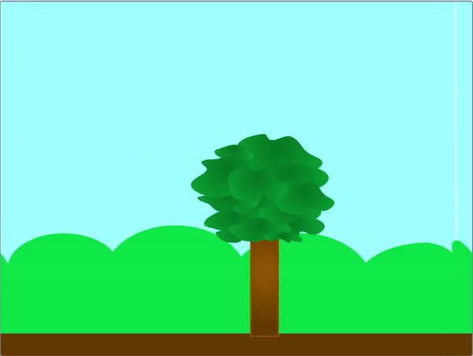
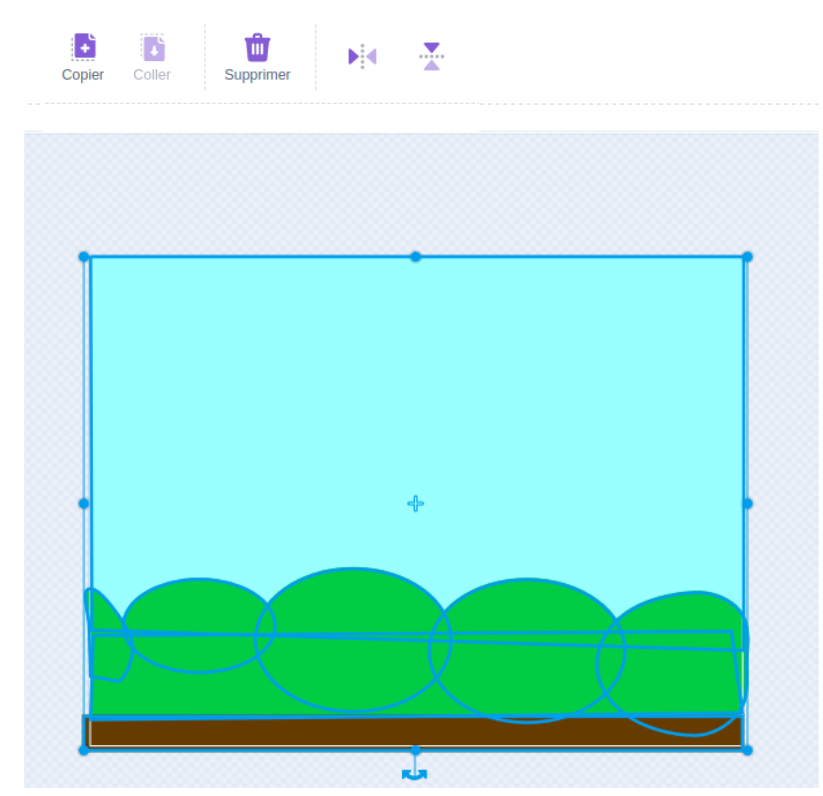
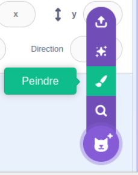
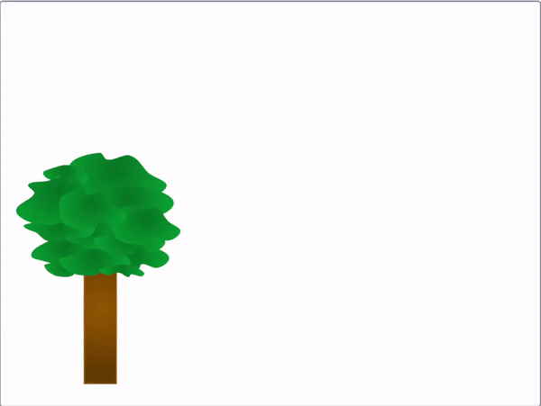

## Créer ta scène de défilement

<div style="display: flex; flex-wrap: wrap">
<div style="flex-basis: 200px; flex-grow: 1; margin-right: 15px;">
Crée une nouvelle scène, puis fais-la défiler avec le mouvement de la souris.
</div>
<div>
{:width="300px"}
</div>
</div>

 --- task ---

Ouvre un [nouveau projet Scratch](https://rpf.io/scratch-new){:target="_blank"}. Scratch s'ouvrira dans un autre onglet du navigateur.

[[[working-offline]]]

--- /task ---

Pense au type de scène que tu vas créer. Tu peux choisir quelques sprites maintenant, pour te donner de l'inspiration. Puis choisis un arrière-plan qui, selon toi, conviendra à la scène que tu imagines.

--- task ---

Choisis un arrière-plan adapté à ta scène, qui correspond à l'environnement où vivraient tes animaux.

[[[generic-scratch3-backdrop-from-library]]]

--- /task ---

Lorsque tu bouges ta souris, ton arrière-plan ou tes sprites doivent bouger aussi. Tu peux faire bouger les sprites de premier plan, ou changer l'arrière-plan en sprite et le faire bouger.

--- task ---

Soit ajouter des sprites supplémentaires à ta scène, qui défilent lorsque la souris est déplacée, ou convertir ton arrière-plan en un sprite et à ce défilement lorsque la souris se déplace.

--- collapse ---
---
title: Convertir un arrière-plan et le faire défiler
---


Dans l'éditeur de peinture **Arrière-plans**, sélectionne l'arrière-plan entier puis utilise l'élément du menu **Copier** pour copier l'arrière-plan entier.



Peins un nouveau sprite et colle la scène de l'arrière-plan dans le nouveau sprite afin qu'il devienne l'un des costumes.



Pour ajouter un comportement de défilement à ton nouveau sprite, tu peux utiliser les scripts suivants. Tu auras besoin d'un moyen de dire si le sprite se déplace vers la gauche ou vers la droite. Dans l’exemple, un « envoyer à tous » est utilisé, mais il peut s’agir de la position de la souris ou des touches ou des boutons.

```blocks3
when I receive [gauche v]
change x by (3)

when I receive [droite v]
change x by (-3)

when I receive [départ v]
go to [arrière v] layer
go to x: (0) y: (0)
create clone of [moi-même v]
change x by (460) 
broadcast [défilement v]

when I receive [défilement v]
forever
if <(x position) > (460)> then
set x to (-460)
end
if <(x position) < (-460)> then
set x to (460)
end
```

--- /collapse ---

--- collapse ---
---
title: Faire défiler les sprites avec le mouvement de la souris
---



Ajoute le code suivant à ton sprite de premier plan pour le faire défiler à gauche et à droite lorsque la souris est déplacée de chaque côté de l'écran. Tu peux ajuster les nombres à ton goût.

```blocks3
when flag clicked
go to x: (0) y: (-80)
forever
if <(mouse x) > (200)> then
change x by (-10)
end
if <(mouse x) < (-200)> then
change x by (10)
end
if <(x position) > (290)> then
set x to (-280)
end
if <(x position) < (-290)> then
set x to (280)
end
```

--- /collapse ---

--- /task ---

Si tu le souhaites, tu peux combiner les deux techniques.


--- save ---
