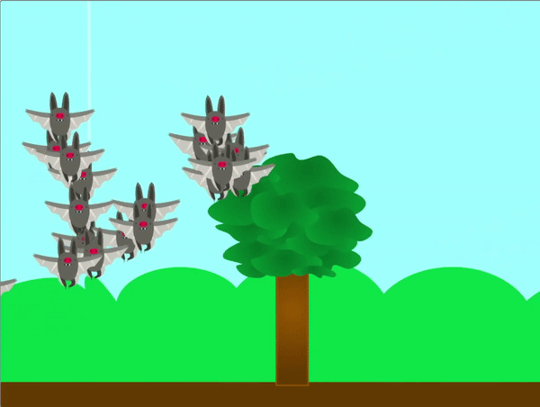
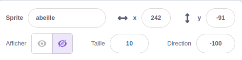

## Ajouter tes clones

<div style="display: flex; flex-wrap: wrap">
<div style="flex-basis: 200px; flex-grow: 1; margin-right: 15px;">
Dans cette étape, tu crées quelques clones qui se déplaceront ensemble.
</div>
<div>
{:width="300px"}
</div>
</div>

<p style="border-left: solid; border-width:10px; border-color: #0faeb0; background-color: aliceblue; padding: 10px;">
**Les animaux sociaux** ont tendance à vivre en groupe. Quelques exemples peuvent être trouvés dans des espèces d'abeilles, de fourmis, d'oiseaux, de poissons et de mammifères tels que les vaches et les moutons.
</p>

--- task ---

**Choisir :** Choisis un sprite **animal**. Il est préférable de choisir un sprite qui représente un animal social, mais le choix dépend de toi. Si tu préfères, tu peux dessiner ton propre sprite, ou en télécharger un sur Scratch à partir d'une photo que tu as trouvée en ligne.

[[[generic-scratch3-add-sprite-from-file]]]

[[[generic-scratch3-sprite-from-library]]]

[[[scratch3-backdrops-and-sprites-using-shapes]]]

--- /task ---

Ton sprite reçoit **beaucoup** de clones, il est donc possible qu'il soit un peu trop grand au départ.

--- task ---

Change la propriété de taille du sprite à une valeur que tu penses raisonnable.



--- /task ---

--- task ---

Lorsque le drapeau est cliqué, ton sprite animal devrait générer des clones, puis se cacher. **Choisir** : Tu peux choisir le nombre de clones générés.

```blocks3
when flag clicked
show
repeat (20)
create clone of [myself v]
end
hide
```

--- /task ---

Tes animaux clonés doivent maintenant récolter de la nourriture. Pour les aider, tu peux utiliser le pointeur de ta souris pour les guider.

--- task ---

Ajoute des blocs pour que les clones se déplacent vers le pointeur de souris de manière aléatoire.

--- collapse ---
---
title: Glisser sur un temps aléatoire
---

Le code suivant fera glisser les clones vers le pointeur de souris dans un temps aléatoire.

```blocks3
when I start as a clone
forever
glide (pick random (1) to (3)) secs to (mouse-pointer v)
```

--- /collapse ---

--- collapse ---
---
title: Glisser vers le pointeur de la souris avec une position aléatoire
---

Le code suivant fera glisser les clones vers le pointeur de souris, mais ajoutera un peu de hasard à la position.

```blocks3
when I start as a clone
forever
glide (pick random (1) to (2)) secs to x: ((pick random (-40) to (40)) + (mouse x)) y: ((pick random (-40) to (40) + (mouse y)))
```

--- /collapse ---

--- /task ---

--- task ---

**Test** : Essaie d'exécuter ton code. Tes clones se comportent-ils comme prévu ? As-tu besoin de modifier le nombre de clones créés ou la façon dont ils se déplacent ?

--- /task ---

--- save ---
