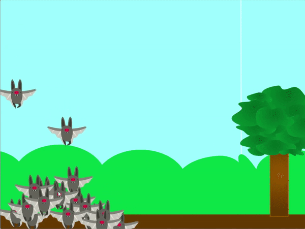

## Nourrir tes clones

<div style="display: flex; flex-wrap: wrap">
<div style="flex-basis: 200px; flex-grow: 1; margin-right: 15px;">
Il est maintenant temps de nourrir tes clones animaux ; le joueur doit les guider vers une source de nourriture pour qu'ils puissent la collecter.
</div>
<div>
{:width="300px"}
</div>
</div>

--- task ---

Choisis, télécharge ou dessine un sprite pour représenter la nourriture que tes animaux vont manger.

--- /task ---

--- task ---

Fais apparaître la nourriture sur l'écran. Il pourrait apparaître dans une position aléatoire et à des moments aléatoires. Il peut se déplacer de manière aléatoire sur l'écran. Peut-être que la nourriture de tes animaux ne bouge pas, mais elle devrait défiler avec le reste du décor.

--- collapse ---
---
title: Faire apparaître un sprite dans une position aléatoire pendant une durée aléatoire
---

Ajuste les plages `aléatoire`{:class='block3operators'} pour modifier la fréquence à laquelle le sprite disparaît et réapparaît.

```blocks3
when flag clicked
forever
hide
wait (pick random (1) to (10)) seconds
show
go to (random position v)
wait (pick random (1) to (10)) seconds
```

--- /collapse ---

--- collapse ---
---
title: Déplacer un sprite au hasard sur l'écran
---

Ajuste la plage `aléatoire`{:class='block3operators'} pour modifier la vitesse à laquelle le sprite se déplace sur l'écran.

```blocks3
when flag clicked
forever
glide (pick random (1) to (2)) secs to (random position v)
```

--- /collapse ---

--- collapse ---
---
title: Faire défiler les sprites avec le mouvement de la souris
---

Ajoute le code suivant à ton sprite pour le faire défiler à gauche et à droite lorsque la souris est déplacée de chaque côté de l'écran.

```blocks3
when flag clicked
go to x: (0) y: (-80)
forever
if <(mouse x) > (200)> then
change x by (-10)
end
if <(mouse x) < (-200)> then
change x by (10)
end
if <(x position) > (290)> then
set x to (-280)
end
if <(x position) < (-290)> then
set x to (280)
end
```

**Test** : Tu dois tester ton code pour t'assurer que la vitesse de défilement n'est pas trop rapide ou trop lente. Assure-toi également que le sprite quitte et rentre correctement l'écran, car les valeurs seront différentes selon la taille de ton sprite.

--- /collapse ---

--- /task ---

Maintenant que tes animaux ont quelque chose à manger, tu peux les guider avec ton pointeur de souris vers leur nourriture. La question est, que devrait-il se passer lorsqu'ils atteignent la nourriture ?

--- task ---

Ajoute du code pour que tes animaux puissent manger leur nourriture. Manger la nourriture devrait la faire disparaître ; voici quelques idées pour ce qui se passera ensuite et comment cela pourrait aider tes animaux.

1. Générer plus de clones
1. Augmenter la taille de tes clones
1. Augmenter un score

--- collapse ---
---
title: Manger la nourriture
---

Un petit ajout à ton code fera disparaître la nourriture lorsqu'elle sera touchée par un clone.

Sur ton sprite **animal**, ajoute des blocs pour que lorsqu'un clone touche le sprite **nourriture**, il diffuse un message.

```blocks3
when I start as a clone
forever
if <touching [animal v]> then
broadcast (eaten v)
end
```

Puis, sur le sprite **nourriture**, cache-le quand il reçoit la diffusion.

```blocks3
when I receive [eaten v]
hide
```

--- /collapse ---

--- collapse ---
---
title: Développer un clone, créer un nouveau clone, ou augmenter un score
---

Ce code permettra aux clones d'augmenter leur taille à chaque fois qu'ils mangent de la nourriture.

```blocks3
when I start as a clone
forever
if <touching [animal v]> then
broadcast (eaten v)
change size by (20)
end
```

Cela générera un nouveau clone chaque fois qu'ils mangent de la nourriture.

```blocks3
when I start as a clone
forever
if <touching [animal v]> then
broadcast (eaten v)
create clone of [myself v]
end
```

Cela augmentera un score lorsque de la nourriture a été mangée.

```blocks3
when flag clicked
set [score v] to (0)

when I start as a clone
forever
if <touching [animal v]> then
broadcast (eaten v)
change [score v] by (10)
end
```
--- /collapse ---

--- /task ---

