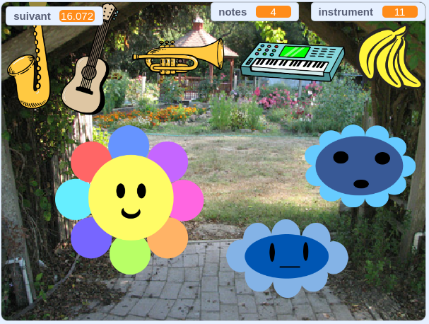

## Et ensuite ?

Si tu suis le parcours [Plus de Scratch](https://projects.raspberrypi.org/fr-FR/pathways/further-scratch), tu peux passer au projet [Créateur de musique](https://projects.raspberrypi.org/fr-FR/projects/music-maker). Dans ce projet, tu vas concevoir ton propre créateur de musique numérique.

--- print-only ---

--- /print-only ---

--- no-print ---

  <iframe allowtransparency="true" width="485" height="402" src="https://scratch.mit.edu/projects/embed/520146902/?autostart=false" frameborder="0"></iframe>

--- /no-print ---

Si tu veux t'amuser davantage à explorer Scratch, tu peux essayer l'un de [ces projets](https://projects.raspberrypi.org/fr-FR/projects?software%5B%5D=scratch&curriculum%5B%5D=%201).

***

Ce projet a été traduit par des bénévoles:

Michel Arnols
Jonathan Vannieuwkerke

Grâce aux bénévoles, nous pouvons donner aux gens du monde entier la chance d'apprendre dans leur propre langue. Vous pouvez nous aider à atteindre plus de personnes en vous portant volontaire pour la traduction - plus d'informations sur [rpf.io/translate](https://rpf.io/translate).
