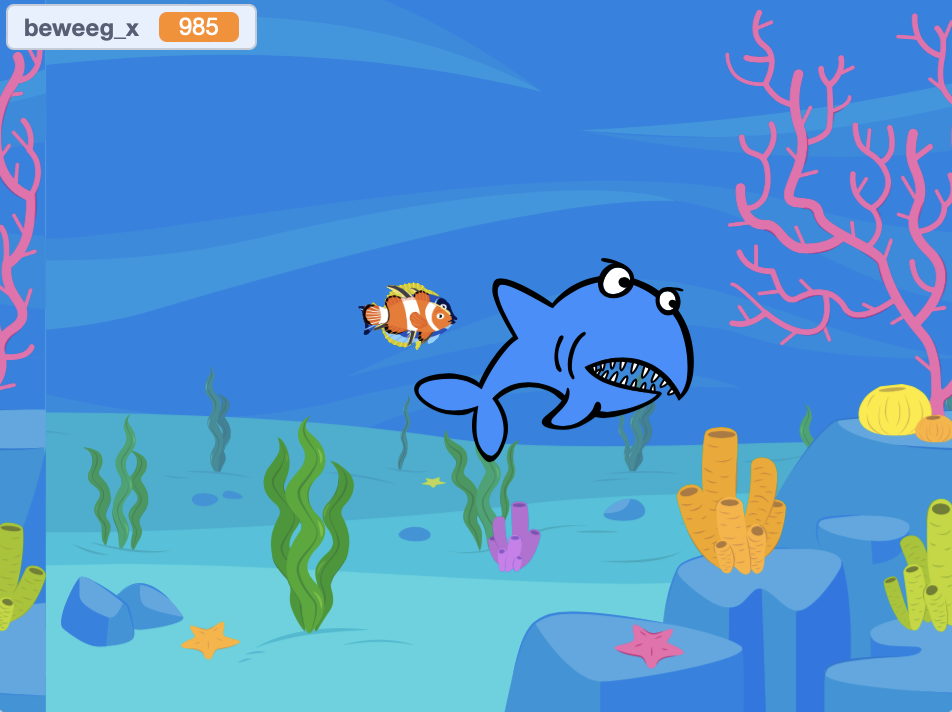

## Wat ga je maken

Maak een spel dat klonen gebruikt om zwermen insecten, scholen vissen, zwermen vogels of elke gewenste groep dieren te maken.

**Groepen dieren** zoals zwermen, scholen en kuddes bewegen zich vaak samen op wat een willekeurige manier lijkt te zijn, maar als je naar de hele groep kijkt, zie je toch wat orde in hun bewegingen.

Je gaat:
+ Klonen gebruiken om een groep dieren te maken
+ Het blok "willekeurig getal tussen ".". en ".." gebruiken om de klonen individueel te laten bewegen
+ De klonen een doel geven in je spel

--- no-print ---

### Afspelen ▶️

--- task ---

  

Beweeg de muis om de vleermuizen te sturen. Houd ze uit de buurt van de leeuw en de pterodactylus. Probeer ze de vlinders te laten eten, om meer vleermuizen te genereren.

**Swarms, schools, and flocks**: [See inside](https://scratch.mit.edu/projects/547542437/editor)

<iframe src="https://scratch.mit.edu/projects/547542437/embed" allowtransparency="true" width="485" height="402" frameborder="0" scrolling="no" allowfullscreen></iframe>

--- /task ---

### Ideeën opdoen 💭

Je gaat een aantal ontwerpbeslissingen nemen om je spelletje te creëren. Denk na over welk type dier je wilt klonen en wat de dieren zullen doen.

--- task ---

Bekijk deze voorbeeldprojecten om meer ideeën op te doen:

**Vissen voeren**: [Bekijk van binnen](https://scratch.mit.edu/projects/546736569/editor){:target="_blank"}

<iframe src="https://scratch.mit.edu/projects/546736569/embed" allowtransparency="true" width="485" height="402" frameborder="0" scrolling="no" allowfullscreen></iframe>

**Vleugelslag**: [Bekijk van binnen](https://scratch.mit.edu/projects/546736368/editor){:target="_blank"}

<iframe src="https://scratch.mit.edu/projects/546736368/embed" allowtransparency="true" width="485" height="402" frameborder="0" scrolling="no" allowfullscreen></iframe>

--- /task --- --- /no-print ---

--- print-only ---

### Ideeën opdoen 💭

Je gaat een aantal ontwerpbeslissingen nemen om je spelletje te creëren. Bekijk de voorbeeldprojecten in Scratch 3: Kloonvoorbeelden Scratch studio (https://scratch.mit.edu/studios/29971894/){:target="_blank"}.

--- /print-only ---

