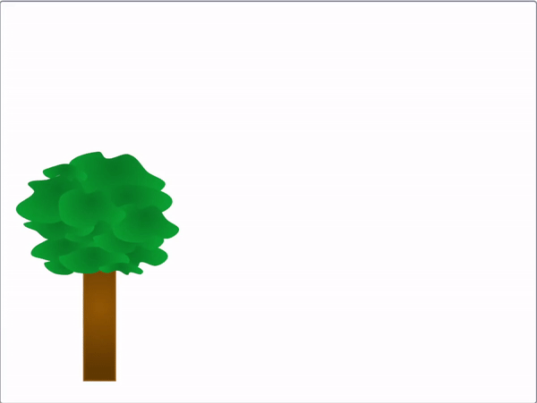

## Maak je bewegende scène

<div style="display: flex; flex-wrap: wrap">
<div style="flex-basis: 200px; flex-grow: 1; margin-right: 15px;">
Maak een nieuwe scène en laat hem daarna met de muis bewegen.
</div>
<div>
{:width="300px"}
</div>
</div>

 --- task ---

Open een [nieuw Scratch-project](https://rpf.io/scratch-new){:target="_blank"}. Scratch opent in een ander browsertabblad.

[[[working-offline]]]

--- /task ---

Denk na over wat voor soort scène je gaat maken. Je kunt nu een paar sprites kiezen om jezelf wat inspiratie te geven. Kies dan een achtergrond waarvan je denkt dat die past bij de scène die je hebt bedacht.

--- task ---

Kies een passende achtergrond voor je scène, een achtergrond die past bij de omgeving waar je dieren zouden leven.

[[[generic-scratch3-backdrop-from-library]]]

--- /task ---

Het moet erop lijken dat als je je muis beweegt dat je achtergrond of sprites ook bewegen. Je kunt de sprites laten bewegen, of de achtergrond veranderen in een sprite en deze laten bewegen.

--- task ---

Ofwel voeg extra sprites toe aan je scène, die bewegen wanneer de muis wordt verplaatst, of verander je achtergrond in een sprite die beweegt wanneer de muis beweegt.

--- collapse ---
---
title: Verander een achtergrond en laat hem bewegen
---


Selecteer in de paint editor van het tabblad **Achtergronden** de hele achtergrond en gebruik vervolgens het menu-item **Kopie maken** om de hele achtergrond te kopiëren.


Teken een nieuwe sprite en plak de achtergrond in de nieuwe sprite zodat het één van de uiterlijken wordt.


Om je sprite te laten bewegen, kun je de volgende scripts gebruiken. Je moet op de een of ander manier aangeven of de sprite naar links of rechts beweegt. In het voorbeeld wordt het blok "zend signaal" gebruikt, maar dit kan de positie van de muis zijn of het indrukken van toetsen/knoppen.

```blocks3
when I receive [left v]
change x by (3)

when I receive [right v]
change x by (-3)

when I receive [start v]
go to [back v] layer
go to x: (0) y: (0)
create clone of [myself v]
change x by (460) 
broadcast [scroll v]

when I receive [scroll v]
forever
if <(x position) > (460)> then
set x to (-460)
end
if <(x position) < (-460)> then
set x to (460)
end
```

--- /collapse ---

--- collapse ---
---
title: Laat sprites bewegen met de muis
---



Voeg de volgende code toe aan je voorgrond sprite om hem naar links en rechts te laten bewegen als de muis naar een van de zijkanten van het scherm wordt verplaatst. Je kunt de getallen naar je eigen smaak aanpassen.

```blocks3
when flag clicked
go to x: (0) y: (-80)
forever
if <(mouse x) > (200)> then
change x by (-10)
end
if <(mouse x) < (-200)> then
change x by (10)
end
if <(x position) > (290)> then
set x to (-280)
end
if <(x position) < (-290)> then
set x to (280)
end
```

--- /collapse ---

--- /task ---

Als je wilt, kun je de twee technieken combineren.


--- save ---
