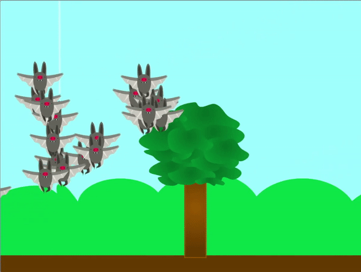

## Voeg je klonen toe

<div style="display: flex; flex-wrap: wrap">
<div style="flex-basis: 200px; flex-grow: 1; margin-right: 15px;">
In deze stap maak je enkele klonen die samen zullen bewegen.
</div>
<div>
{:width="300px"}
</div>
</div>

<p style="border-left: solid; border-width:10px; border-color: #0faeb0; background-color: aliceblue; padding: 10px;">
**Sociale dieren** leven meestal in groepen. Enkele voorbeelden zijn bijen, mieren, vogels, vissen en zoogdieren zoals koeien en schapen.
</p>

--- task ---

**Kies:** Kies een **dieren** sprite. Je kan een dier kiezen dat in een groep leeft, maar de keuze is helemaal aan jou. Als je wilt, kun je je eigen sprite tekenen of er een naar Scratch uploaden vanuit een afbeelding die je online hebt gevonden.

[[[generic-scratch3-add-sprite-from-file]]]

[[[generic-scratch3-sprite-from-library]]]

[[[scratch3-backdrops-and-sprites-using-shapes]]]

--- /task ---

Je sprite krijgt **heel veel** klonen, dus hij kan een beetje te groot zijn om mee te beginnen.

--- task ---

Verander de grootte van de sprite naar een formaat wat logisch is volgens jou.


--- /task ---

--- task ---

Wanneer op de vlag wordt geklikt, moet je dier een paar klonen genereren en zich vervolgens verbergen. **Kies**: Je kunt kiezen hoeveel klonen er worden gemaakt.

```blocks3
when flag clicked
show
repeat (20)
create clone of [myself v]
end
hide
```

--- /task ---

Je gekloonde dieren moeten nu wat voedsel verzamelen. Om ze te helpen kun je je muisaanwijzer gebruiken om ze te begeleiden.

--- task ---

Voeg blokken toe zodat de klonen op willekeurige wijze naar de muisaanwijzer bewegen.

--- collapse ---
---
title: een willekeurige tijd gebruiken om te vliegen
---

De volgende code laat de klonen in een willekeurige tijd naar de muisaanwijzer vliegen.

```blocks3
when I start as a clone
forever
glide (pick random (1) to (3)) secs to (mouse-pointer v)
```

--- /collapse ---

--- collapse ---
---
title: een willekeurige positie gebruiken om naar de muisaanwijzer te vliegen
---

De volgende code laat de klonen naar de muisaanwijzer vliegen, maar op een willekeurige manier.

```blocks3
when I start as a clone
forever
glide (pick random (1) to (2)) secs to x: ((pick random (-40) to (40)) + (mouse x)) y: ((pick random (-40) to (40) + (mouse y)))
```

--- /collapse ---

--- /task ---

--- task ---

**Test**: Probeer je code uit te voeren. Gedragen je klonen zich zoals je verwacht? Moet je het aantal gemaakte klonen of de manier waarop ze bewegen veranderen?

--- /task ---

--- save ---
