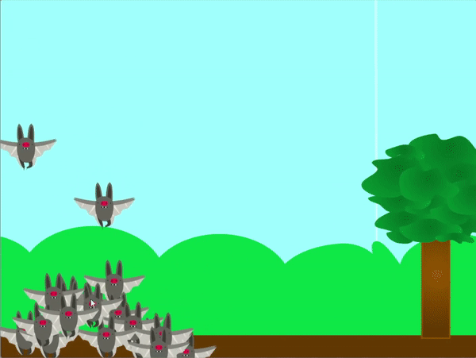

## Voer je klonen

<div style="display: flex; flex-wrap: wrap">
<div style="flex-basis: 200px; flex-grow: 1; margin-right: 15px;">
Nu is het tijd om je dierenklonen te voeren; de speler moet ze naar een voedselbron leiden, zodat ze het kunnen verzamelen.
</div>
<div>
{:width="300px"}
</div>
</div>

--- task ---

Kies, upload of teken een sprite om het voedsel te tonen dat je dieren eten.

--- /task ---

--- task ---

Laat het eten verschijnen op het scherm. Het kan op een willekeurige positie verschijnen en op willekeurige tijden. Het kan willekeurig over het scherm bewegen. Misschien beweegt het voer van je dieren niet, maar groeit het mee met de rest van het landschap.

--- collapse ---
---
title: Laat een sprite voor een willekeurige tijd op een willekeurige positie verschijnen
---

Pas de reeks`willekeurig getal tussen`{:class='block3operators'} aan om te wijzigen hoe vaak de sprite verdwijnt en weer verschijnt.

```blocks3
when flag clicked
forever
hide
wait (pick random (1) to (10)) seconds
show
go to (random position v)
wait (pick random (1) to (10)) seconds
```

--- /collapse ---

--- collapse ---
---
title: Verplaats een sprite willekeurig over het scherm
---

Pas de reeks`willekeurig getal tussen`{:class='block3operators'} aan om te wijzigen hoe snel de sprite over het scherm beweegt.

```blocks3
when flag clicked
forever
glide (pick random (1) to (2)) secs to (willekeurige positie v)
```

--- /collapse ---

--- collapse ---
---
title: Laat sprites bewegen met de muis
---

Voeg de volgende code toe aan je sprite om deze naar links en rechts te laten bewegen terwijl de muis naar een van beide kanten van het scherm wordt bewogen.

```blocks3
when flag clicked
go to x: (0) y: (-80)
forever
if <(mouse x) > (200)> then
change x by (-10)
end
if <(mouse x) < (-200)> then
change x by (10)
end
if <(x position) > (290)> then
set x to (-280)
end
if <(x position) < (-290)> then
set x to (280)
end
```

**Test**: Je moet je code testen om ervoor te zorgen dat de sprite niet te snel of te langzaam beweegt. Zorg er ook voor dat de sprite het scherm correct verlaat en weer binnenkomt, aangezien de waarden verschillen afhankelijk van de grootte van je sprite.

--- /collapse ---

--- /task ---

Nu je dieren iets te eten hebben, kun je ze met je muisaanwijzer naar hun eten leiden. De vraag is, wat moet er gebeuren als ze het voedsel bereiken?

--- task ---

Voeg code toe zodat je dieren hun voedsel kunnen eten. Als het voer wordt opgegeten zou het moeten verdwijnen; hier zijn enkele ideeën voor wat er daarna gebeurt en hoe dit je dieren kan helpen.

1. Maak meer klonen
1. Maak je klonen groter
1. Verhoog een score

--- collapse ---
---
title: Eet het voedsel
---

Een kleine toevoeging aan je code zorgt ervoor dat het voedsel verdwijnt wanneer het wordt aangeraakt door een kloon.

Aan je **dieren** sprite voeg je blokken toe zodat wanneer een kloon de **voedsel** sprite raakt, deze een bericht uitzendt.

```blocks3
when I start as a clone
forever
if <touching [dier v]> then
broadcast (opgegeten v)
end
```

Verberg dan de **voedsel** sprite wanneer deze het bericht ontvangt.

```blocks3
when I receive [opgegeten v]
hide
```

--- /collapse ---

--- collapse ---
---
title: Kweek een kloon, maak een nieuwe kloon of verhoog een score
---

Deze code maakt het mogelijk om de klonen groter te laten worden wanneer ze wat voedsel eten.

```blocks3
when I start as a clone
forever
if <touching [dier v]> then
broadcast (opgegeten v)
change size by (20)
end
```

Er wordt een nieuwe kloon gemaakt elke keer als ze wat eten.

```blocks3
when I start as a clone
forever
if <touching [dier v]> then
broadcast (opgegeten v)
create clone of [mijzelf v]
end
```

Dit zal de score doen toenemen wanneer ze van het voer eten.

```blocks3
when flag clicked
set [score v] to (0)

when I start as a clone
forever
if <touching [dier v]> then
broadcast (eaten v)
change [score v] by (10)
end
```
--- /collapse ---

--- /task ---

