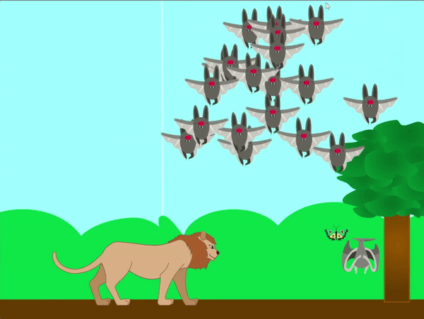

## Voeg een roofdier toe

<div style="display: flex; flex-wrap: wrap">
<div style="flex-basis: 200px; flex-grow: 1; margin-right: 15px;">
Nu kun je een roofdier toevoegen dat een paar van de klonen kan opeten.
</div>
<div>
{:width="300px"}
</div>
</div>

Je moet beslissen over het type roofdier dat je wilt kiezen, omdat dit van invloed kan zijn op de manier waarop het zal bewegen.

Een roofdier op het land kan alleen willekeurig heen en weer lopen over de grond, maar een vliegend roofdier kan willekeurig door de lucht vliegen.

--- task ---

Kies, upload of teken je **roofdier** sprite.

--- /task ---

--- task ---

Voeg beweging toe aan je **roofdier** sprite, zodat het lijkt alsof hij ook beweegt als de achtergrond beweegt. Je kunt de `verander x met`{:class='block3motion'} waarde aanpassen om de snelheid van het roofdier te veranderen.

```blocks3
when flag clicked
go to x: (0) y: (-80)
forever
if <(mouse x) > (200)> then
change x by (-3)
end
if <(mouse x) < (-200)> then
change x by (3)
end
```

--- /task ---


--- task ---

Animeer je roofdier zodat het willekeurig op het speelveld komt, naast het bewegen.

--- collapse ---
---
title: Animeer een willekeurige vliegende sprite
---

De volgende blokken zorgen ervoor dat een sprite willekeurig over het speelveld vliegt. Je kunt de waarden aanpassen om de snelheid van de sprite te veranderen.

```blocks3
when flag clicked
set rotation style [links-rechts v]
forever
point in direction (pick random (0) to (360))
repeat (10)
wait (0.1) seconds
next costume
move (20) steps
if on edge, bounce
```

--- /collapse ---

--- collapse ---
---
title: Animeer een willekeurig lopende sprite
---

De volgende blokken laten een sprite willekeurig bewegen langs de x-as (horizontaal). Je hebt een variabele nodig waarin je opslaat of de sprite naar links of rechts beweegt.

```blocks3
when flag clicked
set rotation style [links-rechts v]
forever
set [links-rechts v] to (pick random (-1) to (1))
if <(left-right) > (0)> then
point in direction (90)
else
point in direction (-90)
repeat (10)
wait (0.1) seconds
next costume
move (20) steps
if on edge, bounce
```

--- /collapse ---

--- /task ---

--- task ---

Om af te ronden, kun je de klonen laten verdwijnen wanneer ze in contact komen met het roofdier. Als je ervoor hebt gekozen om een score variabele toe te voegen, wordt de score misschien elke keer verlaagd. Als je ervoor kiest om de klonen groter te laten worden wanneer ze wat voedsel eten, dan kunnen ze misschien verkleind worden.

```blocks3
when I start as a clone
forever
if <touching [roofdier v]> then
change [score v] by [-10] //Kies dit om de score te verlagen
change size by [-10] //Kies dit om het formaat te verkleinen
delete this clone //Kies dit om de kloon te verwijderen
```

--- /task ---

