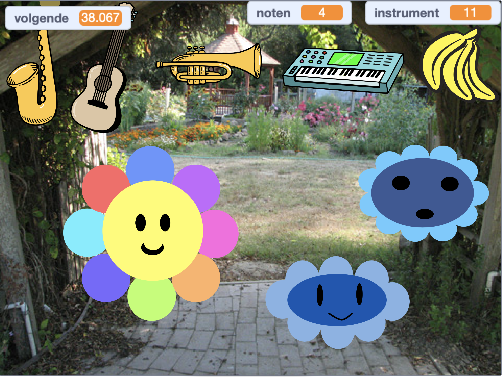

## Wat kun je verder nog doen?

Als je het [Verder met Scratch](https://projects.raspberrypi.org/en/pathways/further-scratch) pad volgt, kun je naar het [Muziekmaker](https://projects.raspberrypi.org/en/projects/music-maker) project gaan. In dit project ontwerp je je eigen digitale muziekmaker.

--- print-only ---

--- /print-only ---

--- no-print ---

  <iframe allowtransparency="true" width="485" height="402" src="https://scratch.mit.edu/projects/embed/520146902/?autostart=false" frameborder="0"></iframe>

--- /no-print ---

Wil je nog meer plezier hebben met het verkennen van Scratch, dan kun je een van [deze projecten](https://projects.raspberrypi.org/en/projects?software%5B%5D=scratch&curriculum%5B%5D=%201) proberen.
